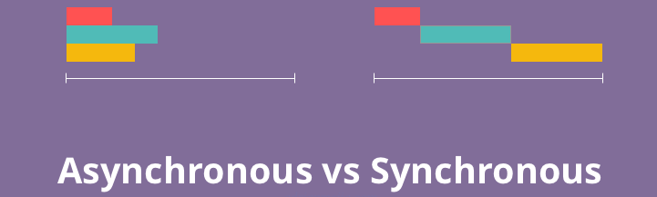
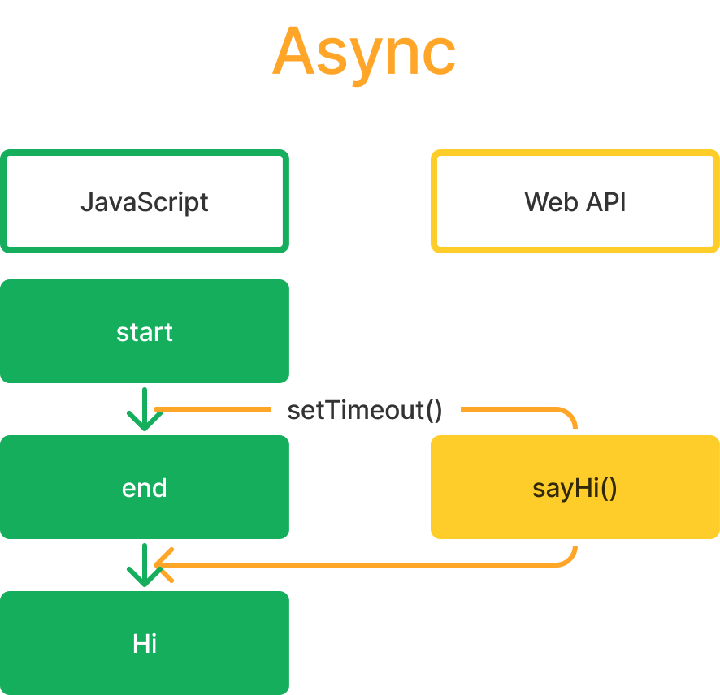

# Ajax

- 大綱

# Sync & Async

💡 Synchronous(sync) 一次執行一個 operation，Asynchronous(async) 一次同時執行多個 operations 。



- JavaScript：single-thread programming language ⇒ **由上到下依序執行程式碼 ⇒ sync**
- 雖然 JS 本身是 sync，但藉由跟 WebAPI (ex：addEventListener, setTimeOut, etc.) 的溝通、互動，會產生 async 的效果
- 範例
  ```jsx
  function sayHi() {
    console.log("Hi");
  }
  // outcome：start => end => Hi
  console.log("start");
  setTimeout(sayHi, 2000); // async
  console.log("end");
  ```
- JS 會跳過 async code 先執行後面的 code，等 WebAPI 執行完後才丟回來給 JS 執行，示意圖如下
  

## fs.readfile example

```jsx
const fs = require("fs");

// sync outcome：start => data: Testing! => end
console.log("start");
const data = fs.readFileSync("fs.txt", "utf-8"); // blocks here until file is read
console.log("data:", data);
console.log("end");

// async outcome：start => end => fs.txt data: Testing!
console.log("start");
fs.readFile("fs.txt", "utf-8", (err, data) => {
  if (err) throw err;
  console.log("fs.txt data:", data);
});
console.log("end");
```

- `readFile()`本身是 async，所以會被跳過先執行下面的`console.log(”end”)`，若想按照順序執行要使用`readFileSync()`
- **若沒必要通常會使用 async function ⇒ 可以多個 task 同時進行不用等，效率較好**

## Callback Hell

- 舊的寫法會運用 callback function 來避免 async function 產生預期外的錯誤
  ⇒ 一層包一層很容易變成 callback hell !
  ⇒ JavaScript 在之後推出了新的語法如 Promise & await 等等來解決 callback hell


# Promise

<aside>
💡 **JavaScript 後續推出的物件，代表了一個 async function 最後是成功還是失敗。**

</aside>

- resolve 代表成功、reject 代表失敗 (error)
- 後續：
  - `resolve` 使用 `.then()`
  - `reject` 使用 `.catch()`
- **Mongoose CRUD 操作就是回傳 Promise !** (有些是回傳 query 物件，但都可以用 then & catch)

## Naive Promise Demo Code

```jsx
// resolve (success)
let resolveExample = new Promise((resolve, reject) => {
  resolve({ data: "data from DB" });
});

resolveExample
  .then((data) => console.log(data))
  .catch((err) => console.log(err));

// reject (failure)
let rejectExample = new Promise((resolve, reject) => {
  reject(new Error("Something wrong!"));
});

rejectExample.then((data) => console.log(data)).catch((e) => console.log(e));
```

## Function Return Promise Demo Code

- 把 async function 包在 Promise 裡面，將結果用 resolve / reject 包起來傳出
- 一定要用 .then() .catch 接，用變數接只會得到一個 Promise 物件

```jsx
function getData(name) {
  if (name == "Chieh") {
    **// promise 要記得 return => .then() 才抓的到!**
    return new Promise((resolve, reject) => {
      setTimeout(() => {
        resolve({ name: "Chieh", age: Math.ceil(Math.random() * 100) });
      }, 2000);
    });
  } else {
    return new Promise((resolve, reject) => {
      **// arrow function 只有一行可以不用加大括號，若有輸出也會自動return (分號也要一併省略)**
      setTimeout(() => reject(new Error("Name not found in DB.")), 2000);
    });
  }
}

function getMovies(age) {
  if (age < 18) {
    return new Promise((resolve, reject) => {
      setTimeout(() => resolve("Cartoons"), 2000);
    });
  } else if (age < 100) {
    return new Promise((resolve, reject) => {
      setTimeout(() => resolve("Movies"), 2000);
    });
  } else {
    return new Promise((resolve, reject) => {
      setTimeout(() => reject(new Error("Too old")), 2000);
    });
  }
}

getData("Chieh")
  .then((data) => {
    console.log(data); // 記得getData 回傳的是一個object，而getMovies要的是其中的property:age
    return getMovies(data.age); // 要記得 return，下一個 .then() 才接的到
  })
  .then((msg) => console.log(msg)) // **一行省略{;} => 自動return**
  .catch((e) => console.log(e)); // **不管是哪一個function的error都有可能catch到，若都發生就看哪個先**
```

# async + await + try + catch (推薦)

<aside>
💡 await 的 function 還是必須是 Promise object !

</aside>

```jsx
// async await try catch 寫法 (promise funciton 沿用上面的)
async function showMovies() {
  try {
    const data = await getData("Chieh");
    console.log(data);
    const msg = await getMovies(data.age);
    console.log(msg);
  } catch (e) {
    console.log("await error");
    console.log(e);
  }
}
showMovies();
```

## 詳述 Promise & Await Differences

### 執行上的差異

- `Promise + .then() + .catch()` 本質仍是 async function
- `async + await` ⇒ **轉為以 sync 方式運行**
  - `async function` 可以用來定義一個非同步函式，讓這個函式本體是屬於非同步，但其內部以**同步的方式運行非同步**程式碼。
  - `await` 則是可以**暫停非同步函式的運行**（中止 `Promise` 的運行），直到非同步進入 resolve 或 reject ，**當接收完回傳值後繼續非同步函式的運行。**
- **~~使用上跟結果來說都沒差就是了...~~**

### Error Handling 的差異

- `then`、`catch`範例程式碼，如果運行正確則會繼續往下運行，**當遭遇失敗則會直接跳到 catch 的流程** ⇒ 相對來說 Promise 的成功、失敗流程的混合撰寫，容易在維護上難以除錯。
  
- `async/await`：因為該片段程式碼已轉為同步的形式，如果遇到錯誤沒有進行例外處理，則會造成後續的程式碼無法繼續運行
  ⇒ 將原有的程式碼直接置入於 `try`流程內，當遇到例外的錯誤時則撰寫在 `catch`區塊內。
  ⇒ 這樣的結構下，就可以將程式碼區分為成功、錯誤兩個流程，閱讀上也會更加容易。
  (若想要針對不同 await 給例外處理，可以用多個 try catch 區分即可)
  

## 寫的挺好的 Reference

[Async function / Await 深度介紹](https://www.casper.tw/development/2020/10/16/async-await/)
